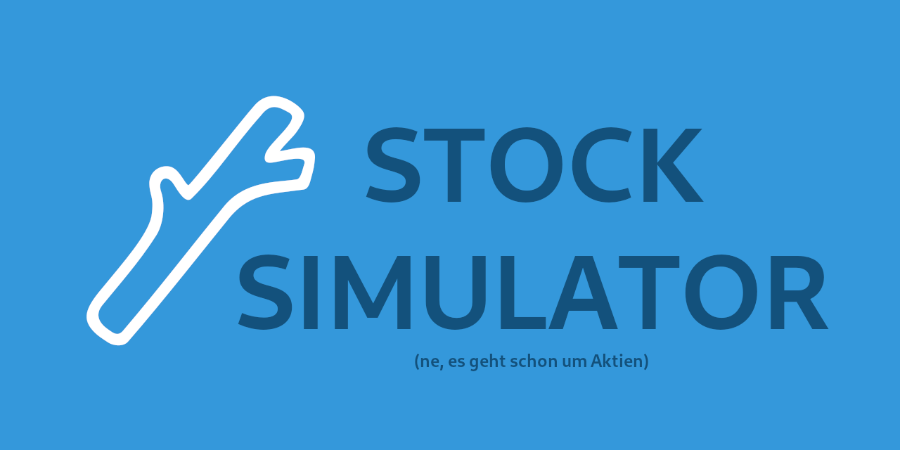

# Stock Simulator

An Android app that allows playing around with data provided primarily by [iexcloud.io](https://iexcloud.io/) and [coingecko.com](https://www.coingecko.com/).

The project's KDoc can be found at [deryeger.github.io/stock-simulator/app/](https://deryeger.github.io/stock-simulator/app/).

The german documentation can be found at https://github.com/lucasheld/stock-simulator-documentation.
